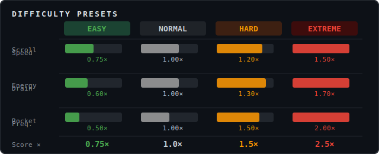
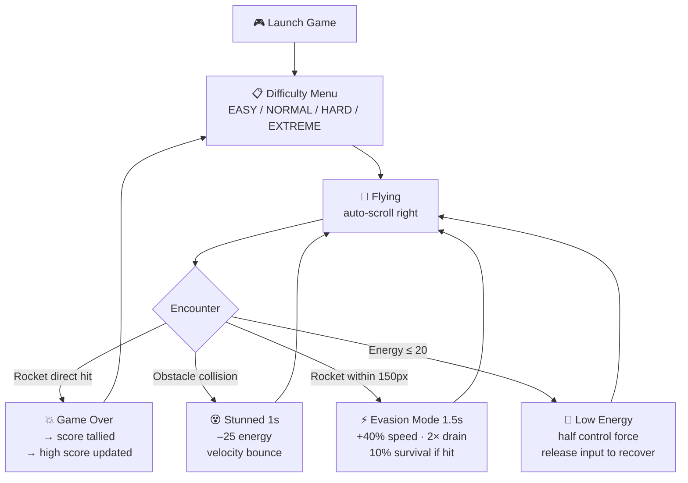
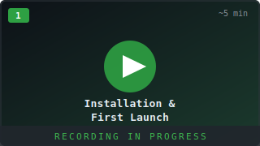
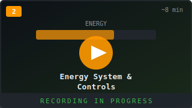
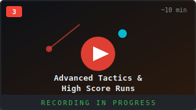

<p align="center">
  
</p>

<h1 align="center">Sugar Glider Adventure</h1>

<p align="center">
  A 2D auto-scrolling survival game built with Godot 4.<br>
  Guide a sugar glider through volcanic terrain, dodge rockets, manage energy, and survive as long as possible.
</p>

<p align="center">
  
  
  
  
</p>

---

## Quick Start

> Get playing in under 2 minutes on any platform.

**Step 1** — Install [Godot Engine 4.x](https://godotengine.org/download/)

**Step 2** — Get the game
```bash
git clone <repository-url>
cd birds
```

**Step 3** — Launch
```bash
godot --path . scenes/main/Main.tscn
```
Or open `project.godot` in the Godot editor and press **F5**.

---

## Table of Contents

- [Installation](#installation)
- [Controls](#controls)
- [How to Play](#how-to-play)
  - [The Core Loop](#the-core-loop)
  - [Energy System](#energy-system)
  - [Flight Physics](#flight-physics)
  - [Obstacles](#obstacles)
  - [Rockets & Hazards](#rockets--hazards)
  - [Evasion Mode](#evasion-mode)
- [Difficulty Settings](#difficulty-settings)
- [HUD Reference](#hud-reference)
- [Game Flow](#game-flow)
- [Video Tutorials](#video-tutorials)
- [Project Structure](#project-structure)
- [Running Tests](#running-tests)
- [Tips & Strategy](#tips--strategy)
- [Troubleshooting](#troubleshooting)

---

## Installation

### Step 1 — Install Godot Engine 4.x

<details>
<summary>🍎 macOS</summary>

**Option A — Homebrew (recommended)**
```bash
brew install godot
```

**Option B — Manual**
1. Go to [godotengine.org/download](https://godotengine.org/download/)
2. Download **Godot Engine 4.x** for macOS (choose ARM64 for Apple Silicon, x86_64 for Intel)
3. Mount the `.dmg` and drag **Godot.app** to your Applications folder
4. First launch: right-click → Open (to bypass Gatekeeper on first run)
5. Add to PATH (optional):
   ```bash
   echo 'export PATH="/Applications/Godot.app/Contents/MacOS:$PATH"' >> ~/.zshrc
   source ~/.zshrc
   ```

</details>

<details>
<summary>🪟 Windows</summary>

**Option A — Scoop (recommended)**
```powershell
scoop bucket add extras
scoop install godot
```

**Option B — Chocolatey**
```powershell
choco install godot
```

**Option C — Manual**
1. Go to [godotengine.org/download](https://godotengine.org/download/)
2. Download **Godot Engine 4.x** for Windows (64-bit)
3. Extract the ZIP to a permanent location (e.g. `C:\Godot\`)
4. Add the folder to your system PATH:
   - Open **Start** → search "Environment Variables"
   - Under **System Variables**, select **Path** → **Edit** → **New**
   - Add the path to the Godot folder (e.g. `C:\Godot\`)

</details>

<details>
<summary>🐧 Linux</summary>

**Ubuntu/Debian — Snap (recommended)**
```bash
sudo snap install godot-4
```

**Flatpak**
```bash
flatpak install flathub org.godotengine.Godot
```

**Arch Linux**
```bash
yay -S godot
# or: sudo pacman -S godot
```

**Fedora**
```bash
sudo dnf install godot
```

**Manual (AppImage)**
```bash
wget https://github.com/godotengine/godot/releases/latest/download/Godot_v4.x-stable_linux.x86_64.zip
unzip Godot_v4.x-stable_linux.x86_64.zip
chmod +x Godot_v4.x-stable_linux.x86_64
sudo mv Godot_v4.x-stable_linux.x86_64 /usr/local/bin/godot
```

</details>

**Verify installation:**
```bash
godot --version
# Expected: 4.x.stable or similar
```

---

### Step 2 — Get the Game

```bash
git clone <repository-url>
cd birds
```

The project is self-contained. No additional assets, packages, or build steps required.

---

### Step 3 — Launch

**From the command line:**
```bash
# Run the game directly
godot --path . scenes/main/Main.tscn

# Or just open the project in the editor
godot --path . --editor
```

**From the Godot Editor:**
```
File → Open Project → Navigate to the 'birds' folder → Select project.godot
                     ↓
        Editor opens showing project structure
                     ↓
        Press F5  (or click the ▶ Play button)
                     ↓
        Select difficulty → Game starts
```

**At startup you will see:**

```
┌─────────────────────────────────────┐
│    SUGAR GLIDER ADVENTURE           │
│                                     │
│    Select Difficulty                │
│                                     │
│  [ EASY      0.75× score ]          │
│  [ NORMAL    1.0×  score ]          │
│  [ HARD      1.5×  score ]          │
│  [ EXTREME   2.5×  score ]          │
└─────────────────────────────────────┘
```

Click a difficulty to begin.

---

## Controls

### Keyboard

```
  ┌─────────────────────────────────────────────────────┐
  │  KEYBOARD CONTROLS                                   │
  │                                                      │
  │         ┌───┐                                        │
  │         │ W │  ── ┐                                  │
  │    ┌────┴───┴────┐ │                                 │
  │    │  A   S   D  │ ├─ Also: Arrow Keys  ─── ┐       │
  │    └─────────────┘ │      or Spacebar (↑)    │       │
  │                    │                         │       │
  │  W / ↑ / Space ────┤ Glide Up               │       │
  │  S / ↓ ────────────┤ Glide Down             │       │
  │  A / ← ────────────┤ Decelerate (slow down) │       │
  │  D / → ────────────┤ Accelerate (speed up)  │       │
  │                    │                         │       │
  │  Esc ──────────────┘ Pause / Resume          │       │
  │  R / Enter ──────────────────────────────────┘       │
  │             Restart (shown on game over screen)      │
  └─────────────────────────────────────────────────────┘
```

### Mouse (Desktop)

Hold **left mouse button** and move the cursor — the glider aims toward your cursor position relative to the screen center. Release to stop steering.

### Touch (Mobile)

Tap the screen and **drag** to set flight direction. The drag must travel at least **30px** from the touch origin for directional input to engage. Release to return to neutral.

---

## How to Play

### The Core Loop

```
  ① Select difficulty
        ↓
  ② Glider auto-flies right — you control vertical & slight horizontal
        ↓
  ③ Steer around obstacles (volcanoes, spires)
        ↓
  ④ Dodge rockets fired from ground launchers
        ↓
  ⑤ Manage energy — active input drains it, passive gliding restores it
        ↓
  ⑥ Navigate thermal updrafts for bonus energy recovery
        ↓
  ⑦ Survive as long as possible — score scales with difficulty
```

---

### Energy System

<p align="center">
  
</p>

The energy bar is the central resource. Mismanage it and you lose control before a rocket ends you.

| State | Condition | Effect |
|-------|-----------|--------|
| **Full** (green) | Energy > 20 | Normal flight, full control force |
| **Draining** | Active directional input held | −15/sec base (×1.5 when climbing, ×0.7 when gliding fast) |
| **Low Energy** (red, <20) | Energy ≤ 20 | Control force halved — very sluggish response |
| **Passive Regen** | No input held | +8/sec (×1.5 in thermal updrafts) |

**Key insight:** The energy bar is self-regulating. The correct play is to make short, targeted input bursts rather than holding a direction continuously.

---

### Flight Physics

<p align="center">
  
</p>

The glider is always subject to gravity. **Horizontal speed generates lift** — the faster you're moving right, the less you sink.

- Speed **≥ 100 px/s**: Lift is generated, glider holds altitude or climbs
- Speed **< 100 px/s**: No lift — free fall begins
- Maximum forward speed: **600 px/s**
- Maximum fall speed: **800 px/s** (terminal velocity)

> **Tip:** Let yourself descend through gaps (free energy) then use a short upward burst to clear the next obstacle. Fighting gravity constantly is the fastest way to drain your energy bar.

---

### Obstacles

**Volcanoes** — Wide triangular formations rising from the ground. Active volcanoes have lava glow.

```
        *
       /|\
      / | \      ← Navigate over the top (if height < ~400px)
     /  |  \        or around the sides
    /   |   \
───/────|────\───  ground
```

- Collision: **1-second stun** + **−25 energy** + velocity bounce
- Navigation: over top, left side, or right side (hints tell you which)

**Spires** — Narrower vertical formations in five variants:

```
  SINGLE    CLUSTER    ARCH       LEANING    CRYSTAL
    |        |||       | |          /         ✦
    |        |||       | |         /          |
    |        |||       | |        /           |
   ─┴─      ─┴┴┴─    ─┘ └─     ─┘          ─┴─
  easy       wide    thread     avoid        max
            bypass    gap       lean       clearance
```

**Navigation hints** appear on-screen when a challenging cluster is ahead, telling you whether to fly high, low, or thread a gap.

---

### Rockets & Hazards

Ground-based launchers fire rockets toward the glider. **A direct hit ends the game.** There are 8 rocket types and 7 firing patterns.

**Threat Level indicator (HUD):**
```
  🚀 THREAT  ░░░░░░░░░░░░  → GREEN  (0–3 rockets) — manageable
  🚀 THREAT  ████░░░░░░░░  → ORANGE (3–6 rockets) — dangerous
  🚀 THREAT  ████████████  → RED    (6+ rockets)  — EXTREME THREAT
```

**Challenge waves** trigger every ~30 seconds (30% chance per interval). Types include:
- Synchronized barrage
- Tracking swarm
- Cluster bomb field
- Smoke screen assault
- Mega launcher event

A screen flash and `INCOMING: [WAVE NAME]` warning appears before each wave. After the wave ends, `ALL CLEAR — SAFE PASSAGE` confirms the threat window is over.

---

### Evasion Mode

When a rocket closes within **150px** while heading toward the glider, **evasion mode** activates automatically for **1.5 seconds**:

```
  Normal state:   glider ●────────────────────────
  Rocket nearby:  glider ●  ←●── rocket approaching
                         ↓
  Evasion mode:   glider ◎  (cyan flash, +40% speed)
                         ↓
  Outcome:    ┌── Rocket misses → evasion ends normally
              └── Direct hit   → 10% survival chance
                                  (50 energy cost, 2s stun)
```

| Property | Evasion Mode Value |
|----------|-------------------|
| Movement force | ×1.4 |
| Energy drain | ×2.0 |
| Energy recovery | ×0.5 |
| Hit survival chance | 10% |

> The cyan glow is your only visual cue that evasion is active. Watch your energy — the doubled drain can empty the bar fast.

---

## Difficulty Settings

<p align="center">
  
</p>

| Preset | Scroll Speed | Energy Drain | Warning Time | Rockets | Score Multiplier |
|--------|:-----------:|:------------:|:------------:|:-------:|:----------------:|
| **EASY** | 0.75× | 0.60× | 1.8× longer | 0.50× | 0.75× |
| **NORMAL** | 1.00× | 1.00× | 1.0× | 1.00× | 1.00× |
| **HARD** | 1.20× | 1.30× | 0.6× shorter | 1.50× | 1.50× |
| **EXTREME** | 1.50× | 1.70× | 0.3× (almost none) | 2.00× | 2.50× |

**Which preset should I choose?**
- **EASY** — Learning the game, understanding energy management, or exploring mechanics without pressure
- **NORMAL** — The intended experience balancing challenge and approachability
- **HARD** — You know the energy system well and want to push for leaderboard scores
- **EXTREME** — Rockets barely give warnings, energy drains fast, and the score reward is enormous — for experts only

Difficulty selection appears on every start and after every game over. The selected preset is saved between sessions.

---

## HUD Reference

```
  ┌──────────────────────────────────────────────────────────────────────┐
  │ ⚡ ENERGY  ████████████████████░░░░░░░░░  72%       Score: 4,280     │
  │ 🚀 THREAT  ████░░░░░░░░░░░░░░░░░░░░░░░░  LOW        Dist:  1,240m   │
  │                                                                       │
  │              ⚠  NARROW SPIRE CLUSTER AHEAD — FLY HIGH  ⚠             │
  └──────────────────────────────────────────────────────────────────────┘
```

| Element | Position | Description |
|---------|----------|-------------|
| **Energy bar** | Top-left | Green → Yellow → Red as energy drops below 50% / 20% |
| **Threat level bar** | Second row | Active rocket count: Green (low) / Orange / Red (extreme) |
| **Score** | Top-right | Points from distance + bonuses, scaled by difficulty preset |
| **Distance** | Right | Meters traveled — used for difficulty scaling |
| **Navigation hint** | Center | Obstacle type and recommended path, fades after 3–4 seconds |
| **Wave alert** | Center | Challenge wave name, flashes orange-red before appearing |
| **Extreme Threat** | Center | Shown in red when 6+ rockets are active simultaneously |

**Debug overlay** (press **F** during play): shows velocity vector, input direction magnitude, and current animation state — useful for understanding the physics.

---

## Game Flow



---

## Video Tutorials

Optional video walkthroughs for common tasks. Click to expand each section.

<details>
<summary>📹 Tutorial 1: Installation &amp; First Launch (~5 min)</summary>

<p align="center">
  
</p>

> 🎬 **Recording in progress.** Once available, the thumbnail above will link to the video.
> In the meantime, the written [Installation](#installation) guide covers everything step-by-step.

**This tutorial will cover:**
- Installing Godot 4 on macOS, Windows, and Linux (all three shown)
- Cloning the repository and opening `project.godot` in the editor
- Navigating the Godot editor for the first time — what each panel does
- Selecting a difficulty preset and starting your first game
- Common first-launch errors and how to resolve them (Gatekeeper, PATH issues, etc.)

**Written equivalent:** [Installation](#installation) → [Step 3 — Launch](#step-3--launch)

</details>

<details>
<summary>📹 Tutorial 2: Understanding the Energy System &amp; Controls (~8 min)</summary>

<p align="center">
  
</p>

> 🎬 **Recording in progress.**
> The [Energy System](#energy-system) and [Controls](#controls) sections explain this in text form.

**This tutorial will cover:**
- How the energy bar depletes and regenerates — live demonstration
- The difference between holding input vs. short bursts (with score comparison)
- How horizontal speed creates lift — why slowing down causes sinking
- Mouse steering vs. keyboard — which is more precise and when to use each
- Reading navigation hints — understanding "FLY HIGH" / "THREAD GAP" / "AVOID LEAN"
- What "evasion mode" looks like visually and how to survive it

**Written equivalent:** [Energy System](#energy-system) → [Flight Physics](#flight-physics) → [Controls](#controls)

</details>

<details>
<summary>📹 Tutorial 3: Advanced Tactics &amp; High Score Runs (~10 min)</summary>

<p align="center">
  
</p>

> 🎬 **Recording in progress.**
> The [Tips & Strategy](#tips--strategy) section covers the key points in text form.

**This tutorial will cover:**
- The "descend and burst" rhythm — maximizing distance on minimum energy
- Thermal updraft hunting — where they appear and how to route through them
- Reading the rocket warning system — anticipating patterns before they fire
- Surviving challenge waves — positioning during barrages
- HARD vs. EXTREME difficulty comparison — when the score multiplier is worth it
- High score run breakdown — decision by decision analysis

**Written equivalent:** [Tips & Strategy](#tips--strategy) → [Difficulty Settings](#difficulty-settings)

</details>

---

## Project Structure

```
birds/
├── project.godot                    # Project config, input map, autoloads
├── scenes/
│   ├── main/
│   │   ├── Main.tscn                # Root scene: UI + game world
│   │   └── GameWorld.tscn           # Scrolling play area with parallax
│   ├── player/
│   │   └── SugarGlider.tscn         # Player character (CharacterBody2D)
│   ├── environment/
│   │   ├── VolcanoObstacle.tscn     # Volcano with lava glow
│   │   └── SpireObstacle.tscn       # 5-variant rock/crystal spire
│   └── hazards/
│       ├── Rocket.tscn              # 8 rocket types
│       └── RocketLauncher.tscn      # 8 launcher types, 7 patterns
├── scripts/
│   ├── autoload/
│   │   ├── GameManager.gd           # State, score, difficulty presets, save/load
│   │   ├── InputManager.gd          # Keyboard, mouse, touch (with smoothing)
│   │   └── AudioManager.gd          # Audio bus management
│   ├── player/
│   │   └── SugarGlider.gd           # Flight physics, energy system, evasion
│   ├── main/
│   │   └── Main.gd                  # Difficulty UI, camera, WorldEnvironment
│   ├── environment/
│   │   ├── ScrollingManager.gd      # Parallax, speed scaling, thermal zones
│   │   ├── ObstacleManager.gd       # Obstacle tracking, navigation hints
│   │   ├── TerrainGenerator.gd      # Procedural + pattern-based generation
│   │   ├── VolcanoObstacle.gd       # Volcano physics, lava PointLight2D
│   │   └── SpireObstacle.gd         # Spire variants, crystal PointLight2D
│   └── hazards/
│       ├── Rocket.gd                # Projectile (tracking, cluster, spiral, etc.)
│       ├── RocketLauncher.gd        # Warning system, salvo sequencing
│       └── RocketManager.gd         # Challenge waves, difficulty escalation
├── assets/
│   ├── sprites/
│   │   └── sugar_glider_placeholder.svg
│   └── readme/                      # Diagrams embedded in this README
│       ├── energy_cycle.svg
│       ├── difficulty_scale.svg
│       ├── flight_path.svg
│       └── tutorial_thumb_1/2/3.svg
├── resources/
│   └── SugarGliderSprites.tres      # Animation frame definitions (placeholder)
└── tests/                           # Automated test suite
    ├── base/TestBase.gd
    ├── unit/                        # GameManager, InputManager, SugarGlider, presets
    ├── integration/                 # Physics fly-through scenarios
    ├── examples/                    # Reference templates for new tests
    ├── run_all_tests.gd
    └── README.md
```

---

## Running Tests

The project includes a self-contained headless test suite with 39 tests covering game state, physics, energy, input, and difficulty presets.

```bash
# Run all tests (requires godot on PATH)
./run_tests.sh

# Or directly
godot --path . --headless --script tests/run_all_tests.gd

# Run a single suite
godot --path . --headless --script tests/unit/test_game_manager.gd
```

Expected output:
```
═══════════════════════════════════════
  ✓ ALL PASSED
  39 passed, 0 failed, 39 total
═══════════════════════════════════════
```

See [`tests/README.md`](tests/README.md) for full documentation on adding tests.

---

## Tips & Strategy

**Energy management (most important skill)**
- Never hold a direction continuously — use short bursts, then release and glide
- When you see a gap below an obstacle, dive through it instead of climbing over (free altitude change)
- Watch for the hint text — it knows what's ahead before you can see it

**Thermals (free recovery)**
- Thermal updrafts appear roughly every 800px, sized 150×200px
- They provide 1.5× energy regen AND slight upward push
- Routing through a thermal before a hard section can make the difference

**Rocket survival tactics**
- Rockets launch from ground level — gaining altitude early gives you more time to react
- The warning light on a launcher flashes before it fires — learn to spot it in your peripheral vision
- During HARD/EXTREME, warning times are shortened; position defensively by staying in the upper third of the screen
- Evasion mode activates automatically — your job is to keep enough energy that the doubled drain doesn't immediately leave you helpless

**Scoring optimization**
- EXTREME difficulty awards 2.5× score per point — if you can survive for 500m on EXTREME, that beats 1,000m on NORMAL
- Near-misses with rockets award bonus points (closer = more points)
- Each obstacle successfully passed awards points scaled to obstacle type (Crystal Spire = 20 pts)
- Challenge waves temporarily flood the screen with rockets but award significant near-miss bonuses if you survive

---

## Troubleshooting

| Problem | Solution |
|---------|----------|
| **"Project failed to load"** | Open `project.godot` (the file, not the folder) in Godot 4.x |
| **Game window doesn't appear** | Run `godot --version` to verify Godot 4.x is installed |
| **Controls not responding** | Check Project Settings → Input Map; ensure no other app intercepts keyboard |
| **macOS: "app is damaged" error** | `xattr -cr /Applications/Godot.app` in Terminal |
| **macOS: Gatekeeper blocks launch** | System Settings → Privacy & Security → Allow Godot |
| **Poor performance / low FPS** | Project Settings → Rendering → Anti-Aliasing → set MSAA to Off or 2x |
| **Slow on older hardware** | Project Settings → Rendering → Renderer → switch Forward+ to Compatibility |
| **Black screen / no visuals** | Update GPU drivers; try `-rendering-driver opengl3` flag |
| **Tests fail to run** | Ensure Godot is on PATH or set `GODOT_BIN=/path/to/godot ./run_tests.sh` |
| **High score not saving** | Check write permissions for Godot's user data directory (`user://`) |
