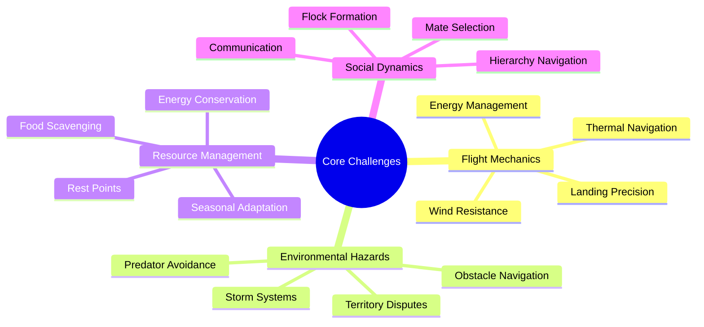
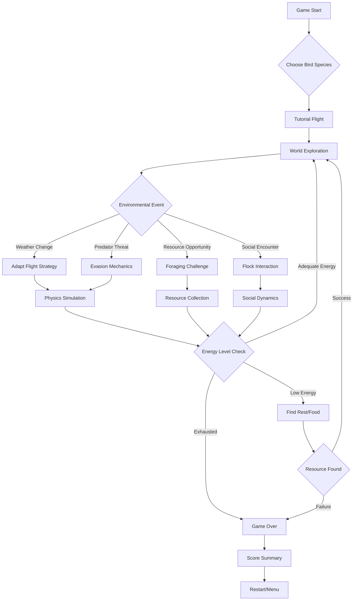
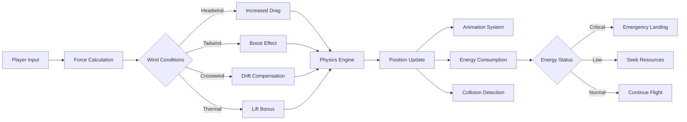
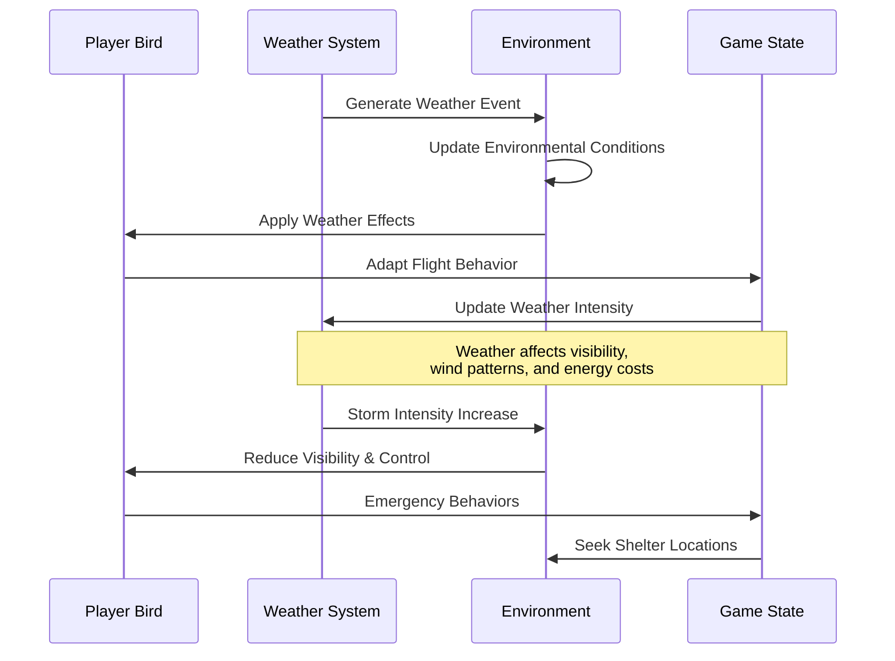
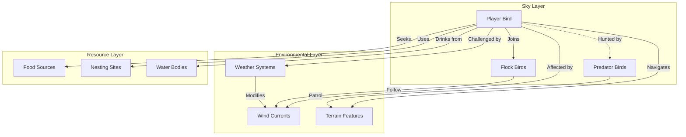
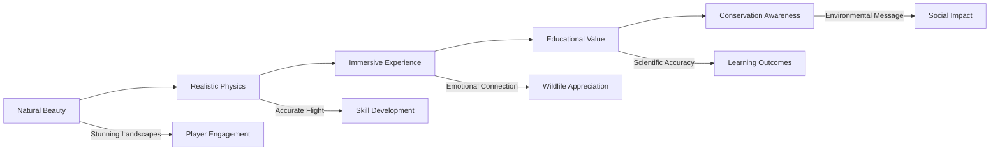
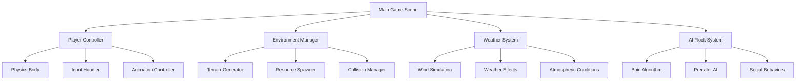

# Birds 🐦

An immersive bird flight simulation game built with Godot Engine, featuring realistic aerial mechanics, environmental challenges, and survival elements.

## 🎮 Game Overview

**Birds** is a physics-based flight simulation where players navigate the challenges of avian life through dynamic environments. Experience the freedom and perils of flight as you soar through diverse landscapes, adapt to changing weather patterns, and overcome natural obstacles.

## 🌟 Core Themes

### 🌪️ **Freedom vs. Survival**
Navigate the tension between the exhilarating freedom of flight and the constant need to survive in a dynamic ecosystem.

### 🌍 **Environmental Adaptation**
Adapt to changing seasons, weather patterns, and environmental hazards that affect flight mechanics and survival strategies.

### 🏔️ **Journey and Migration**
Experience epic migration journeys across varied terrains, each presenting unique challenges and opportunities.

### 🤝 **Flock Dynamics**
Interact with other birds, form flocks for protection, and learn from collective behavior patterns.

## 🎯 Core Challenges



## 🎲 Game Mechanics Flow



## 🌊 Flight Physics System



## 🏞️ Environmental Systems

### Dynamic Weather Patterns



### Ecosystem Interactions



## 🎪 Challenge Categories

### 🌪️ **Weather Challenges**
- **Thunderstorms**: Navigate through limited visibility and turbulent winds
- **Fog Banks**: Rely on instinct and sound navigation when vision fails
- **Blizzards**: Survive extreme cold while maintaining flight control
- **Heat Thermals**: Master rising air currents for energy-efficient flight

### 🦅 **Predator Encounters**
- **Aerial Predators**: Outmaneuver hawks, eagles, and falcons through evasive flying
- **Ground Threats**: Time landings carefully to avoid ground-based predators
- **Camouflage**: Use environmental features to break line of sight

### 🍃 **Navigation Puzzles**
- **Migration Routes**: Follow ancient pathways through landmarks and magnetic fields
- **Territory Boundaries**: Respect established bird territories or face confrontation
- **Optimal Pathfinding**: Choose routes that balance distance, safety, and energy efficiency

### 🏆 **Survival Mechanics**
- **Energy Management**: Balance flight exertion with rest and feeding needs
- **Seasonal Adaptation**: Adjust behavior for breeding, molting, and migration seasons
- **Food Chain Awareness**: Understand your role in the ecosystem's complex relationships

## 🎨 Visual Design Philosophy



## 🚀 Getting Started

### System Requirements

**Minimum Requirements:**
- **OS**: Windows 10+, macOS 10.14+, or Linux (Ubuntu 18.04+ or equivalent)
- **RAM**: 4GB minimum, 8GB recommended
- **Storage**: 500MB for Godot Engine + 200MB for game
- **Graphics**: OpenGL ES 3.0 / DirectX 11 compatible
- **CPU**: Dual-core 2.0 GHz or equivalent

**Recommended for Development:**
- **RAM**: 16GB for comfortable development experience
- **SSD**: For faster asset loading and compilation
- **Dedicated Graphics**: For better performance testing

### Installing Godot Engine

#### 🪟 Windows Installation

**Option 1: Official Download (Recommended)**
1. Visit [godotengine.org/download](https://godotengine.org/download/)
2. Download **Godot Engine 4.x** (Standard version)
3. Extract the downloaded ZIP file to a folder (e.g., `C:\Godot\`)
4. Add Godot to your system PATH:
   - Right-click "This PC" → Properties → Advanced System Settings
   - Click "Environment Variables"
   - Under "System Variables", find "Path" and click "Edit"
   - Add the Godot folder path (e.g., `C:\Godot\`)
5. Verify installation: Open Command Prompt and type `godot --version`

**Option 2: Chocolatey**
```powershell
# Install Chocolatey if not already installed
Set-ExecutionPolicy Bypass -Scope Process -Force
iex ((New-Object System.Net.WebClient).DownloadString('https://chocolatey.org/install.ps1'))

# Install Godot
choco install godot
```

**Option 3: Scoop**
```powershell
# Install Scoop if not already installed
iex "& {$(irm get.scoop.sh)} -RunAsAdmin"

# Install Godot
scoop bucket add extras
scoop install godot
```

#### 🍎 macOS Installation

**Option 1: Official Download (Recommended)**
1. Visit [godotengine.org/download](https://godotengine.org/download/)
2. Download **Godot Engine 4.x** for macOS
3. Mount the DMG file and drag Godot to Applications folder
4. **Important**: First launch may require allowing the app in System Preferences → Security & Privacy
5. Add to PATH (optional):
   ```bash
   echo 'export PATH="/Applications/Godot.app/Contents/MacOS:$PATH"' >> ~/.zshrc
   source ~/.zshrc
   ```
6. Verify installation: `godot --version`

**Option 2: Homebrew**
```bash
# Install Homebrew if not already installed
/bin/bash -c "$(curl -fsSL https://raw.githubusercontent.com/Homebrew/install/HEAD/install.sh)"

# Install Godot
brew install godot
```

**macOS-Specific Notes:**
- On Apple Silicon Macs, ensure you download the ARM64 version for best performance
- Gatekeeper may initially block the app - go to System Preferences → Security & Privacy to allow it
- For development, you may need Xcode Command Line Tools: `xcode-select --install`

#### 🐧 Linux Installation

**Ubuntu/Debian:**
```bash
# Method 1: Snap (Recommended - always latest version)
sudo snap install godot-4

# Method 2: Flatpak
sudo apt install flatpak
flatpak install flathub org.godotengine.Godot

# Method 3: AppImage (Manual)
wget https://github.com/godotengine/godot/releases/download/4.x.x/Godot_v4.x.x-stable_linux.x86_64.zip
unzip Godot_v4.x.x-stable_linux.x86_64.zip
chmod +x Godot_v4.x.x-stable_linux.x86_64
sudo mv Godot_v4.x.x-stable_linux.x86_64 /usr/local/bin/godot
```

**Arch Linux:**
```bash
# AUR package
yay -S godot

# Or using pacman (may be older version)
sudo pacman -S godot
```

**Fedora:**
```bash
# DNF package
sudo dnf install godot

# Or Flatpak
flatpak install flathub org.godotengine.Godot
```

**Linux Dependencies:**
Ensure you have required libraries:
```bash
# Ubuntu/Debian
sudo apt update
sudo apt install libgl1-mesa-glx libxrandr2 libxss1 libgconf-2-4 libasound2

# Fedora
sudo dnf install mesa-libGL libXrandr libXScrnSaver GConf2 alsa-lib

# Arch
sudo pacman -S mesa libxrandr libxss gconf alsa-lib
```

### 🎮 How Godot Engine Works

Godot is a free, open-source game engine that uses a scene-tree architecture:

#### **Core Concepts:**

1. **Nodes and Scenes**: Everything in Godot is a node. Scenes are collections of nodes arranged in a tree structure
2. **GDScript**: Python-like scripting language (also supports C# and C++)
3. **Physics Engine**: Built-in 2D and 3D physics simulation
4. **Rendering**: Modern Vulkan/OpenGL renderer with advanced lighting and effects
5. **Platform Export**: Single codebase deploys to multiple platforms

#### **For This Game:**
- **Bird Physics**: Uses Godot's CharacterBody2D or RigidBody2D for realistic flight mechanics
- **Weather System**: Particle systems and shaders create dynamic weather effects
- **AI Flocks**: Uses Godot's built-in pathfinding and custom boid algorithms
- **Audio**: 3D spatial audio for immersive environmental sounds
- **Input**: Unified input system works across desktop, mobile, and gamepads

### 📥 Setting Up the Project

1. **Clone the Repository:**
   ```bash
   git clone <repository-url>
   cd birds
   ```

2. **Open in Godot:**
   - Launch Godot Engine
   - Click "Import" in the Project Manager
   - Navigate to the cloned `birds` folder
   - Select `project.godot` and click "Import & Edit"

3. **First Launch Setup:**
   - Godot will automatically import all assets (this may take a few minutes)
   - The editor will open showing the project structure
   - Assets are processed and cached in the `.godot/` folder

### 🎯 Running the Game

#### **From Godot Editor:**
1. Open the project in Godot
2. Click the "Play" button (▶️) or press `F5`
3. Select the main scene if prompted (usually `scenes/main/Main.tscn`)
4. The game will launch in a new window

#### **From Command Line:**
```bash
# Run the game
godot --path . --main-pack

# Run a specific scene
godot --path . scenes/main/Main.tscn

# Run in debug mode with console output
godot --path . --debug
```

#### **Exported Builds:**
After exporting the game (see Platform Export section), you can run:
- **Windows**: Double-click `birds.exe`
- **macOS**: Open `birds.app` or run from Terminal
- **Linux**: `./birds` or double-click the executable

### 🎮 Game Controls

**Desktop Controls:**
- **Mouse**: Look around (if camera control is enabled)
- **WASD** or **Arrow Keys**: Flight controls
- **Spacebar**: Flap wings / Ascend
- **Shift**: Dive / Descend
- **Tab**: Toggle UI/HUD
- **Esc**: Pause menu

**Mobile Controls:**
- **Touch**: Tap and drag for flight direction
- **Double Tap**: Quick ascent
- **Long Press**: Dive
- **Pinch**: Zoom camera (if enabled)

### 🔧 Development Setup

**For Contributors and Modders:**

1. **Install Version Control:**
   ```bash
   # Git is required for version control
   git config --global user.name "Your Name"
   git config --global user.email "your.email@example.com"
   ```

2. **Recommended Tools:**
   - **VS Code** with Godot extension for external script editing
   - **Aseprite** for pixel art assets
   - **Audacity** for audio editing
   - **Blender** for 3D models (if needed)

3. **Project Structure Understanding:**
   ```
   birds/
   ├── project.godot          # Main project file
   ├── scenes/               # Game scenes (.tscn)
   ├── scripts/             # GDScript files (.gd)
   ├── assets/             # Art, audio, fonts
   ├── resources/          # Godot resources (.tres)
   └── .godot/            # Build cache (auto-generated)
   ```

### 🚨 Troubleshooting

**Common Issues:**

**"Project failed to load" Error:**
- Ensure you're opening `project.godot`, not a folder
- Check that Godot version is 4.x or compatible
- Try reimporting: Project → Tools → Reimport

**Performance Issues:**
- Update graphics drivers
- Lower graphics settings in project settings
- Close other applications to free up RAM
- Check system meets minimum requirements

**Audio Not Working:**
- Check system audio settings
- Verify audio drivers are installed
- Test with other applications
- Try different audio output device

**Controls Not Responding:**
- Check input map in Project Settings → Input Map
- Test with different input devices
- Verify no other applications are intercepting input

**Platform-Specific Issues:**

**Windows:**
- If antivirus blocks Godot: Add exception for Godot folder
- For permission errors: Run Godot as administrator (temporarily)
- DirectX issues: Update DirectX runtime

**macOS:**
- Gatekeeper blocking: System Preferences → Security & Privacy → Allow
- Performance on older Macs: Try OpenGL renderer in project settings
- Code signing issues: `codesign --force --deep --sign - /Applications/Godot.app`

**Linux:**
- Missing dependencies: Install packages listed in Linux Dependencies section
- Audio issues: Check PulseAudio/ALSA configuration
- Graphics problems: Update GPU drivers, try different desktop environment

### 🔄 Keeping Updated

**Update Godot Engine:**
- Check [godotengine.org](https://godotengine.org) for latest releases
- Backup your project before updating
- Test thoroughly after updates
- Read release notes for breaking changes

**Update the Game:**
```bash
git pull origin main
# Restart Godot to reload assets
```

Ready to take flight? Open Godot, load the project, and experience the freedom of the skies! 🦅

## 🛠️ Technical Architecture



## 🌍 Supported Platforms

- **🖥️ Desktop**: Windows, macOS, Linux
- **📱 Mobile**: Android, iOS
- **🎮 Console**: Planned for future releases

---

*Experience the world from a bird's eye view. Master the skies, survive the elements, and discover the true meaning of freedom in flight.*

## 🤝 Contributing

We welcome contributions! Please see [CLAUDE.md](CLAUDE.md) for development guidelines and platform-specific build instructions.

## 📄 License

This project is licensed under the MIT License - see the [LICENSE](LICENSE) file for details.